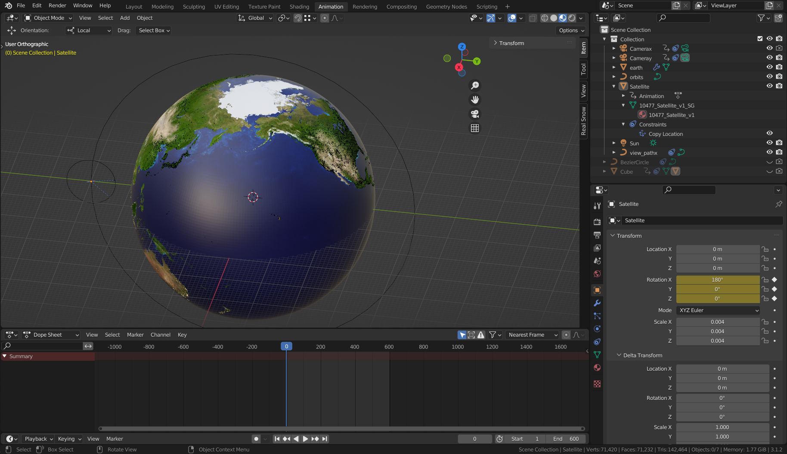
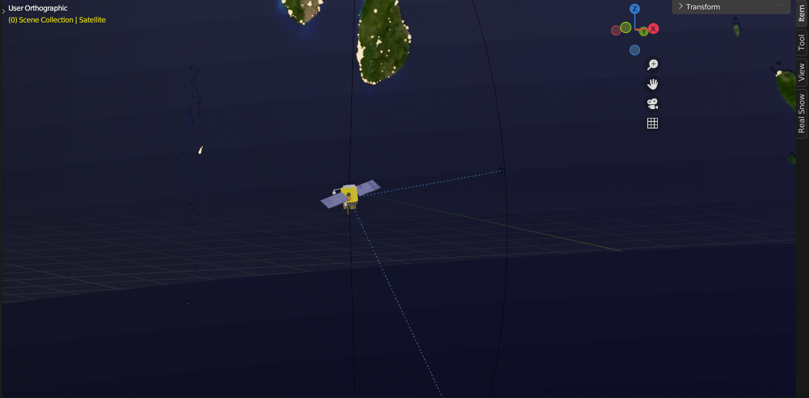
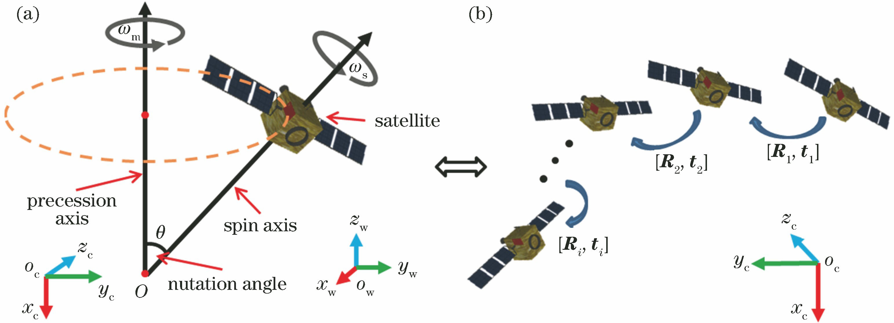
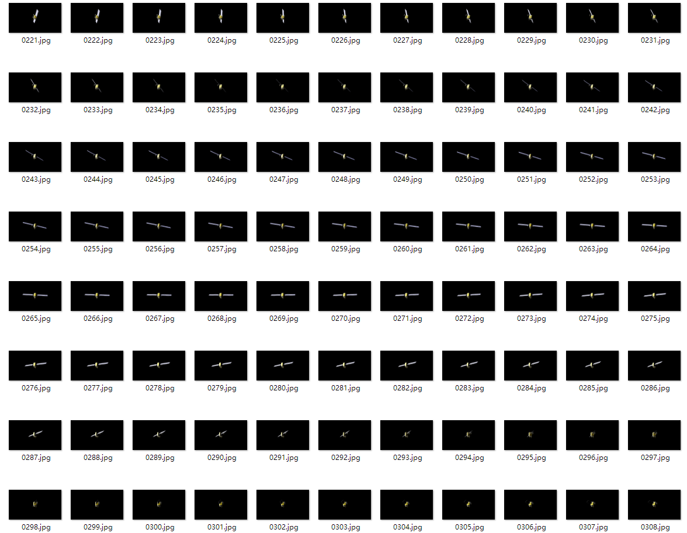

# Space object detection
Based on SMA and YOLO V7 and Blender Simulation

## Simulating data with Blender

The [Earth](https://free3d.com/3d-model/earth-94721.html) and [Satellite](https://free3d.com/3d-model/satellite-v1--384167.html) model used in this project are downloaded from [Free3D.com](https://free3d.com/)

Based on the motion pattern of the satellite, I animated the model and output 1200 images, covering all the different attitudes.

## Annotating dataset with ISAT_with_segment_anything

[ISAT_with_segment_anything](https://github.com/yatengLG/ISAT_with_segment_anything) is an awesome tool which use segment anything to realize semantic annotation.

But it's only output COCO Dataset format annotation, so I have written a conversion program to convert their annotation files to VOC format.

The conversion program is [here](https://github.com/fusheng-ji/ISAT_SMA-to-VOC).

After annotating can we finally training our own YOLO v7.

## Training and Inferencing with YOLO V7

1. Preparing Dataset 
    This project using VOC format dataset for training.

  Organizing your own Dataset like following structure:  

  - VOCdevkit
    - VOC2007
      - Annotation
        - Your Annotation xmls
      - JPEGImages
        - Your Pictures 

2. Progressing Dataset

  run *voc_annotation.py* to obtain *2007_train.txt* and *2007_val.txt* for training。   

  change **classes_path** in *voc_annotation.py*.

  **classes_path** refer to **./cls_classes.txt** which contain categories that you want to detect. 

3. Now training 

  After change your **classes_path** in every file, then you can run *train.py*, the *.pth* files will be stored in /logs folder.  

4. Inference the results

  Change the **model_path** and **classes_path** in *yolo.py*.
  Finally run *predict.py* to predict.  

## Reference

Main Code: https://github.com/bubbliiiing/yolov7-pytorch

Picture: Rongrong Lu, Haibo Sun, Shuangfei Fu, Feng Zhu, Yingming Hao.  Point Cloud Registration Based Satellite Motion Parameter Identification Method[J]. Laser & Optoelectronics Progress, 2019, 56(14): 141503.
